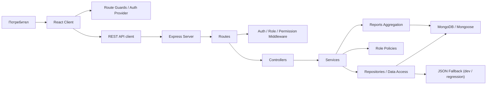
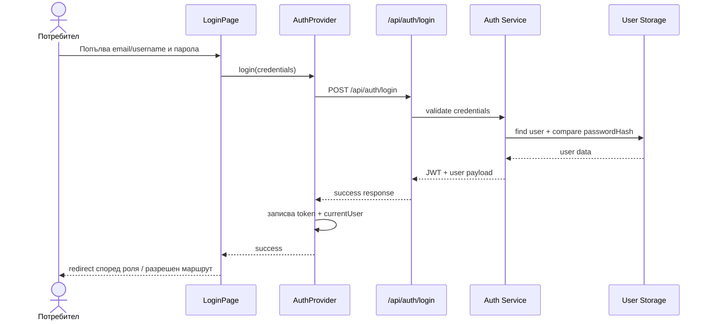

# Системна документация

## 1. Тема и цел на проекта

**Тема:** „Проектиране и реализация на уеб-базирана модулна система за управление на приюти за животни с използване на REST архитектура“.

Системата има за цел да подпомага ежедневната работа на приют за животни чрез:
- управление на животни и техните статуси;
- управление на потребители и роли;
- подаване и обработка на заявки за осиновяване;
- административен контрол и аналитични отчети.

Проектът е реализиран като **уеб приложение с ясно разделени frontend и backend слоеве**, използващо **REST API**, **Node.js / Express.js**, **React**, **MongoDB / Mongoose** и защитен auth слой с **JWT**.

## 2. Архитектура

### 2.1 Архитектурен стил

Проектът следва **клиент-сървърна архитектура** с ясна модулна структура:
- **Frontend слой**: React приложение за визуализация, navigation, forms, guards и state за текущия потребител.
- **Backend слой**: Express приложение с route, controller, service и policy логика.
- **Data слой**: MongoDB чрез Mongoose модели, плюс JSON fallback за локална разработка и regression тестове.

### 2.2 Слоеве в backend-а

- **Routes**: дефинират URL адреси, HTTP методи и middleware защита.
- **Controllers**: съдържат request/response логика и стандартизиран API output.
- **Services**: съдържат бизнес правилата на модулите.
- **Repositories / data access**: използват се там, където има смисъл да се отдели четенето/записът от бизнес логиката.
- **Models**: Mongoose схеми за основните домейн обекти.
- **Shared policies**: централизирани правила за роли и permissions.

### 2.3 Диаграма на компонентите



## 3. Технологии

### 3.1 Backend
- Node.js
- Express.js
- MongoDB
- Mongoose
- JWT
- bcrypt
- dotenv

### 3.2 Frontend
- React
- React Router
- Vite
- CSS

### 3.3 Допълнителни елементи
- JSON fallback режим за локална разработка
- regression / smoke script за основните сценарии
- `.env.example` за конфигурация

## 4. Роли и права

В системата са дефинирани следните роли:

### 4.1 Guest
Нелогнат потребител.

Може да:
- вижда началната страница;
- разглежда животни и техните детайли;
- използва търсене и филтри;
- вижда обща информация за приюта;
- отива към login/register.

### 4.2 Client
Публично регистриран потребител.

Може да:
- вижда и редактира собствения си профил;
- сменя собствената си парола;
- разглежда животни;
- подава заявки за осиновяване;
- вижда собствените си заявки;
- отменя собствена `pending` заявка;
- следи статуса на собствените си заявки.

### 4.3 Employee
Служител, създаден от admin.

Може да:
- вижда и редактира собствения си профил;
- сменя собствената си парола;
- създава, редактира и променя статус на животни;
- вижда всички заявки за осиновяване;
- филтрира и обработва заявки;
- добавя вътрешни бележки;
- вижда оперативни справки.

### 4.4 Admin
Потребител с пълен административен достъп.

Може да:
- всичко от employee;
- вижда всички потребители;
- създава employee;
- редактира роли и активност на потребители;
- активира / деактивира профили;
- достъпва admin dashboard;
- вижда reports и аналитични обобщения.

## 5. Основни модули

### 5.1 Auth модул
Покрива:
- register;
- login;
- logout;
- password hashing;
- JWT-based auth;
- auth middleware;
- role-based защита.

### 5.2 Users модул
Покрива:
- собствен профил (`/api/users/me`);
- редакция на собствени данни;
- смяна на собствена парола;
- admin списък с потребители;
- admin детайлна страница;
- създаване на employee;
- промяна на роля и активност.

### 5.3 Animals модул
Покрива:
- list view;
- detail view;
- search / filters / sort / pagination;
- create / edit;
- status change;
- deactivate / archive;
- role-based UI и backend защита.

### 5.4 Adoptions модул
Покрива:
- подаване на заявка от client;
- „Моите заявки“;
- staff/admin списък на всички заявки;
- детайлен преглед на заявка;
- status update;
- cancel flow;
- синхронизация със статуса на животното.

### 5.5 Reports / Dashboard модул
Покрива:
- dashboard summary cards;
- животни по статус;
- животни по вид;
- заявки по статус;
- осиновявания;
- потребители по роля;
- активни / неактивни профили;
- intake по период;
- периодни филтри и JSON export.

## 6. База данни и домейн модели

### 6.1 User
Основни полета:
- `firstName`
- `lastName`
- `username`
- `email`
- `passwordHash`
- `role`
- `isActive`
- `lastLoginAt`
- `createdAt`
- `updatedAt`

Бизнес правила:
- email и username са уникални;
- role е една от: `client`, `employee`, `admin`;
- deactivated user не трябва да влиза нормално.

### 6.2 Animal
Основни полета:
- `slug`
- `name`
- `displayName`
- `species`
- `breed`
- `age`
- `gender`
- `size`
- `status`
- `isActive`
- `intakeDate`
- `healthStatus`
- `vaccinated`
- `neutered`
- `description`
- `imageUrls`
- `createdAt`
- `updatedAt`

Статуси:
- `available`
- `reserved`
- `adopted`
- `medical-care`
- `inactive`
- `archived`

### 6.3 AdoptionRequest
Основни полета:
- `user`
- `animal`
- `status`
- `motivation`
- `contactPhone`
- `internalNotes[]`
- `createdAt`
- `updatedAt`

Статуси:
- `pending`
- `under-review`
- `approved`
- `rejected`
- `cancelled`
- `completed`

### 6.4 Връзки между моделите
- Един `User` може да има много `AdoptionRequest` записи.
- Едно `Animal` може да има много `AdoptionRequest` записи.
- `AdoptionRequest` свързва конкретен потребител с конкретно животно.
- При промяна на adoption status се обновява и animal status.

## 7. Бизнес правила

### 7.1 Auth и users
- Само admin може да вижда всички потребители.
- Само admin може да създава employee.
- Само admin може да сменя роля и `isActive`.
- Потребителят може да редактира само собствения си профил.
- Потребителят може да сменя само собствената си парола.

### 7.2 Animals
- Guest и client имат read-only достъп.
- Employee и admin могат да create/edit/change status.
- Само admin може да deactivate/archive.
- `delete` не е физическо изтриване, а логическо извеждане от активна употреба.

### 7.3 Adoptions
- Само client може да подава заявка.
- Заявка се подава само за животно със статус `available`.
- Client вижда само собствените си заявки.
- Employee/admin виждат всички заявки.
- Employee/admin могат да сменят статус.
- Client не може да сменя статус.
- Client може да отменя само собствена `pending` заявка.
- Не се допуска дублираща активна заявка за същото животно от същия client.

### 7.4 Синхронизация adoption ↔ animal
- `under-review` или `approved` резервира животното като `reserved`.
- `completed` променя животното на `adopted`.
- `cancelled` или `rejected` връща животното към `available`, ако няма друга активна заявка, която да го държи резервирано.

## 8. REST API

### 8.1 Auth endpoints
| Method | Endpoint | Описание |
|---|---|---|
| GET | `/api/auth/status` | Проверка на текущата auth сесия |
| POST | `/api/auth/login` | Вход |
| POST | `/api/auth/register` | Регистрация на client |
| POST | `/api/auth/logout` | Изход |

### 8.2 Users endpoints
| Method | Endpoint | Описание |
|---|---|---|
| GET | `/api/users/me` | Текущ профил |
| PATCH | `/api/users/me` | Редакция на текущ профил |
| PATCH | `/api/users/me/password` | Смяна на собствена парола |
| GET | `/api/users` | Admin списък с потребители |
| GET | `/api/users/:userId` | Admin детайли за потребител |
| POST | `/api/users/employees` | Създаване на employee |
| PATCH | `/api/users/:userId` | Admin редакция на потребител |
| PATCH | `/api/users/:userId/status` | Активиране / деактивиране |

### 8.3 Animals endpoints
| Method | Endpoint | Описание |
|---|---|---|
| GET | `/api/animals` | Списък с search/filter/sort/pagination |
| GET | `/api/animals/:animalId` | Детайли за животно |
| POST | `/api/animals` | Създаване на животно |
| PATCH | `/api/animals/:animalId` | Редакция на животно |
| PATCH | `/api/animals/:animalId/status` | Промяна на статус |
| PATCH | `/api/animals/:animalId/deactivate` | Deactivate / archive |

### 8.4 Adoptions endpoints
| Method | Endpoint | Описание |
|---|---|---|
| POST | `/api/adoptions` | Подаване на заявка |
| GET | `/api/adoptions/my` | Моите заявки |
| GET | `/api/adoptions` | Всички заявки за staff/admin |
| GET | `/api/adoptions/:requestId` | Детайли за заявка |
| PATCH | `/api/adoptions/:requestId/status` | Staff/admin status update |
| PATCH | `/api/adoptions/:requestId/cancel` | Cancel на собствена pending заявка |

### 8.5 Reports endpoints
| Method | Endpoint | Описание |
|---|---|---|
| GET | `/api/reports/overview` | Dashboard summary и агрегирани справки |
| GET | `/api/reports/animal-master-data` | По-дълбок animal master-data отчет |

## 9. Use case-и

### 9.1 Guest разглежда животни
1. Отваря началната страница.
2. Използва search/filter.
3. Отваря списък с животни.
4. Отваря детайлна страница на животно.
5. При желание за осиновяване се насочва към login/register.

### 9.2 Client подава заявка за осиновяване
1. Логва се в системата.
2. Отваря детайли за животно със статус `available`.
3. Избира „Подай заявка за осиновяване“.
4. Попълва телефон и мотивация.
5. Системата създава `AdoptionRequest`.
6. Client вижда заявката в „Моите заявки“.

### 9.3 Employee обработва заявка
1. Логва се като служител.
2. Отваря списъка със заявки.
3. Филтрира по статус.
4. Отваря детайлите за конкретна заявка.
5. Променя статуса и добавя вътрешна бележка.
6. Системата синхронизира и статуса на животното.

### 9.4 Admin управлява потребители
1. Логва се като admin.
2. Отваря списъка с потребители.
3. Филтрира по роля/активност.
4. Отваря detail страница.
5. Редактира роля, email или статус.
6. При нужда деактивира профил.

### 9.5 Admin използва dashboard
1. Отваря `/admin/reports`.
2. Избира период или custom range.
3. Преглежда summary cards и breakdown панели.
4. При нужда експортира текущия отчет като JSON.

## 10. Sequence диаграми

### 10.1 Login flow



### 10.2 Adoption flow

```mermaid
sequenceDiagram
    actor Client as Client
    participant Details as AnimalDetailsPage
    participant Form as CreateAdoptionRequestPage
    participant API as /api/adoptions
    participant Service as Adoption Service
    participant Animal as Animal Storage
    participant Request as AdoptionRequest Storage

    Client->>Details: Отваря детайли на available animal
    Details-->>Client: Показва CTA за осиновяване
    Client->>Form: Отваря формата
    Client->>Form: Попълва motivation + contactPhone
    Form->>API: POST /api/adoptions
    API->>Service: validate request
    Service->>Animal: проверка за available status
    Animal-->>Service: animal record
    Service->>Request: create adoption request
    Request-->>Service: saved request
    Service-->>API: success response
    API-->>Form: created request
    Form-->>Client: success feedback + link към My Adoptions

    actor Staff as Employee/Admin
    participant StaffAPI as /api/adoptions/:id/status

    Staff->>StaffAPI: PATCH status
    StaffAPI->>Service: update adoption status
    Service->>Animal: sync animal status
    Service-->>StaffAPI: updated request + updated animal state
```

## 11. Навигация и frontend интеграция

Основните frontend секции са:
- `/` – home page
- `/animals` – list page
- `/search` – results page по query параметри
- `/animals/:animalId` – detail page
- `/animals/new` – create animal
- `/animals/:animalId/edit` – edit animal
- `/login` и `/register`
- `/profile`
- `/adoptions/my`
- `/adoptions/:requestId`
- `/staff/adoptions`
- `/admin/adoptions`
- `/admin/users`
- `/admin/users/:userId`
- `/admin/reports`

Frontend route guard-ите са синхронизирани с backend authorization логиката.

## 12. Конфигурация и стартиране

### 12.1 Примерен `.env`

```env
PORT=5000
DB_URL=mongodb://localhost:27017/animal-shelter
JWT_SECRET=your_jwt_secret_here
ANIMALS_ALLOW_MOCK_FALLBACK=false
```

### 12.2 Стъпки за стартиране

1. Копирай `.env.example` в `.env`.
2. Инсталирай зависимости:

```bash
npm ci
```

Ако `npm ci` не мине:

```bash
npm install
```

3. Стартирай в dev режим:

```bash
npm run dev
```

4. За production build:

```bash
npm run build
npm start
```

### 12.3 Regression check

```bash
npm run check:regression
```

Това валидира основните сценарии за:
- auth;
- users;
- animals;
- adoptions;
- reports.

## 13. Deployment бележки

За локална защита е важно:
- да не се качват `node_modules`;
- да не се качва `.env`;
- да остане `.env.example`;
- да се пазят `package-lock.json` файловете;
- зависимостите да се инсталират наново на конкретната машина / операционна система.

Production среда трябва да осигурява:
- Node.js runtime;
- MongoDB instance;
- валиден `JWT_SECRET`;
- build-нат frontend;
- backend process manager или стандартен Node startup.

## 14. Заключение

Проектът вече покрива не само CRUD операции, а реална **модулна система за управление на приют за животни** с:
- роли и достъп;
- защита и auth;
- бизнес логика за осиновяване;
- административно управление на потребители;
- управленски dashboard и аналитични справки.

Това го прави подходяща основа за дипломна разработка по зададената тема.
